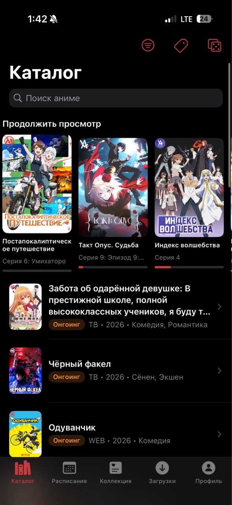
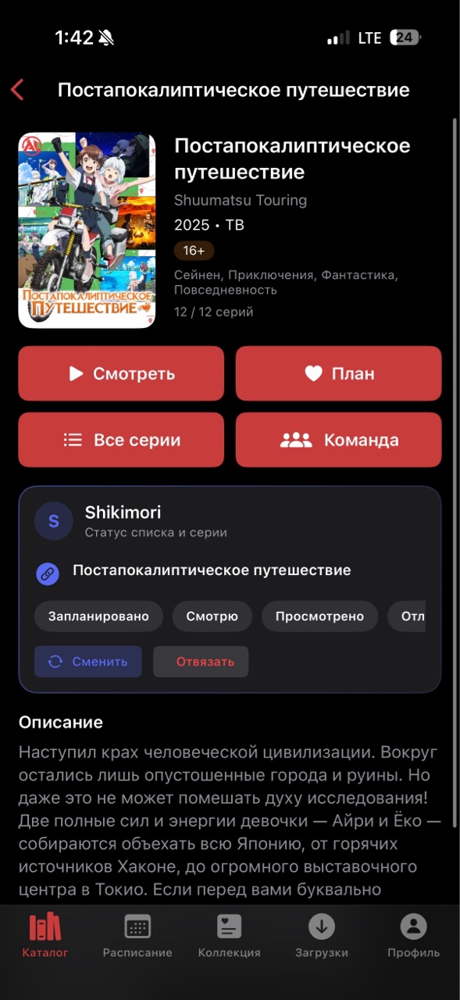
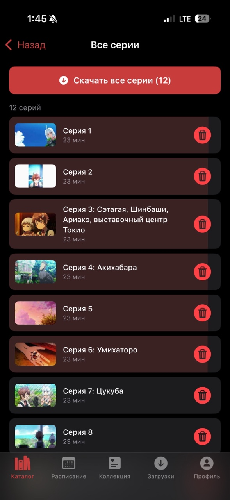
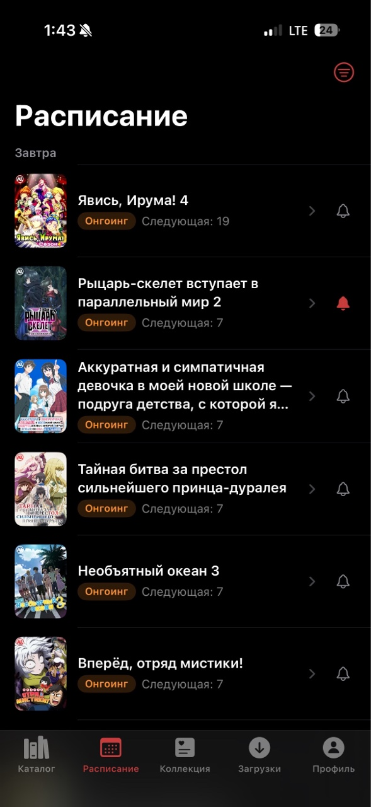
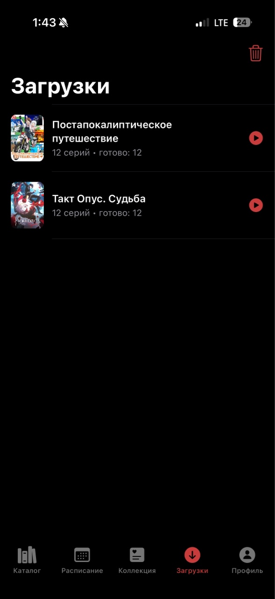
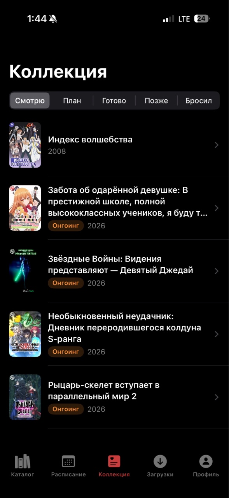
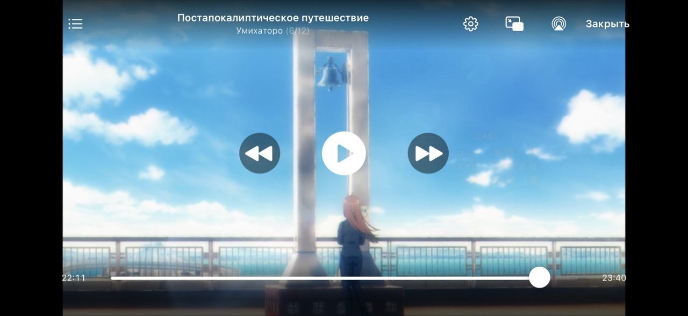

# AniLibDown

Нативное iOS-приложение на **SwiftUI** для просмотра и скачивания аниме с [AniLiberty](https://aniliberty.top).

**Версия:** 1.1.2 · **iOS:** 17+

> **Важно:** приложение полностью написано нейросетью. Возможны баги и нестабильная работа.  
> Если что-то сломалось — создайте запись в [Проблемах](https://github.com/Festov/AniLibDown/issues) (желательно со скриншотом).

## Скриншоты

  
  
  

  
  
  

  

## Возможности

- **Каталог** — лента аниме, поиск с историей запросов, фильтры по жанрам, сортировке и году, блок «Продолжить просмотр»
- **Расписание** — ближайшие выходы и расписание на неделю, подписка на напоминания о сериях (уведомления)
- **Карточка тайтла** — описание, жанры, связанные релизы, команда озвучки, список серий (с возможностью скачивания)
- **Онлайн-просмотр** — HLS-плеер с выбором качества (в том числе во время просмотра), сменой серий, перемоткой, пропуском OP/ED, субтитрами (если есть в потоке), Picture-in-Picture и AirPlay
- **Прогресс** — сохранение места просмотра и продолжение с той же серии (так как работает на кеше, может времени работать некорректно)
- **Офлайн** — скачивание серий (по одной или все сразу), очередь загрузок, повтор при ошибке, просмотр без интернета (и скачивание возможно при **ЗАБЛОКИРОВАННОМ** телефоне, то есть не нужно держать телефон "открытым")
- **Уведомления** — о выходе новых серий и о завершении загрузки; напоминание в день выхода (для онгоингов)
- **Аккаунт AniLiberty** — вход, профиль, коллекции («Смотрю», «В планах», «Просмотрено» и др.) с синхронизацией
- **Shikimori** (опционально) — привязка тайтлов, статусы списка, синхронизация серии при досмотре, экспорт/импорт привязок
- **Настройки** — тема, заставка, качество по умолчанию, параметры плеера и загрузок (в т.ч. только Wi‑Fi), очистка кэша и другое

## Установка на iPhone

### 1. Скачайте IPA

1. Откройте **[Releases](https://github.com/Festov/AniLibDown/releases)**
2. Скачайте **`AniLibDown.ipa`** из последнего релиза

### 2. Установите через Sideloadly (Windows)

1. На iPhone: **Настройки → Конфиденциальность и безопасность → Режим разработчика**
2. Установите **[Sideloadly](https://sideloadly.io)** (учитывая то, что у Вас установлен уже iTunes)
3. Подключите iPhone по USB или WI-FI и разблокируйте
4. Перетащите IPA в Sideloadly (или выберите через «Выбор .ipa»)
5. Укажите Apple ID (при первом запуске нужно ввести логин и пароль от аккаунта Apple ID) и устройство 
6. Нажмите **Start**
7. На iPhone: **Настройки → Основные → VPN и управление устройством** → доверьте разработчику

### Ограничения бесплатного Apple ID | Важно!

- Приложение живёт **~7 дней**, затем нужна переустановка
- Можно настроить обновление по Wi‑Fi в одной сети с ПК

## Лицензия

> Проект создан в образовательных целях. Контент принадлежит правообладателям и предоставляется через AniLiberty.
